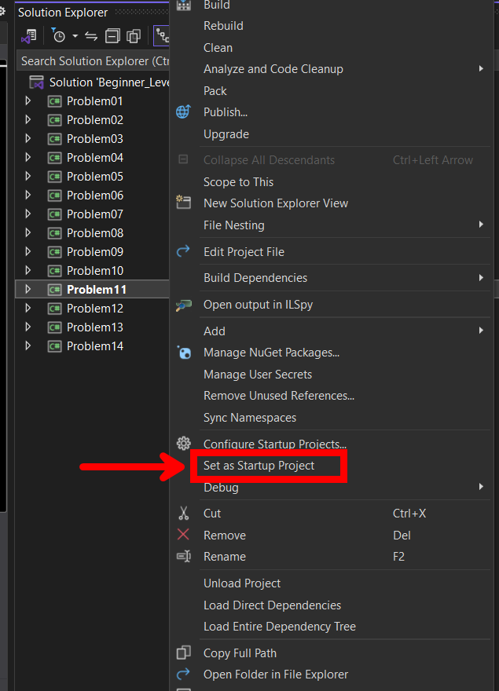

# How to Submit Your Solutions 


### 1. Fork the Repository
- Go to https://github.com/ziadyousef1/Beginner_Level_Week_09_-_Week10
- Click "Fork" to create your own copy

### 2. Get Your Fork
```bash
# Replace "YourUsername" with your GitHub username
git clone https://github.com/YourUsername/Beginner_Level_Week_09_-_Week10.git
cd Beginner_Level_Week_09_-_Week10
```

### 3. Create Your Personal Branch
```bash
# Replace "YourName" with your actual name
git checkout -b YourName-solutions

# Examples:
# git checkout -b omar-solutions
# git checkout -b ahmed-solutions
```

### 4. Work on Problems
- Open Visual Studio
- Right-click any problem → "Set as Startup Project"
- Write your solution
- Repeat for other problems

**How to Set as Startup Project:**


### 5. Save All Your Work
```bash
git add .
git commit -m "add solutions by [YourName]"
```

### 6. Upload Your Branch
```bash
git push origin YourName-solutions
```

### 7. Create Pull Request
- Go to your fork on GitHub
- Click "Contribute" → "Open pull request"
- Write: "Solutions by [YourName]"
- Click "Create pull request"

## Need Help?
If you need help with the process, watch these videos:
- [GitHub Fork and Pull Request Tutorial](https://youtu.be/n43bagVuJPU?si=hPHjomJd7XJh-XcF)
- [How To Use GitHub Branches & Pull Request](https://youtu.be/6EQN0gJL7y8?si=HQ6LvgQYqCSpe-VQ)


## Important Note:
- **NO AI TOOLS ALLOWED** - Write your own code
